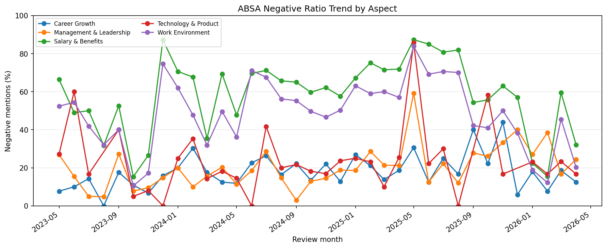
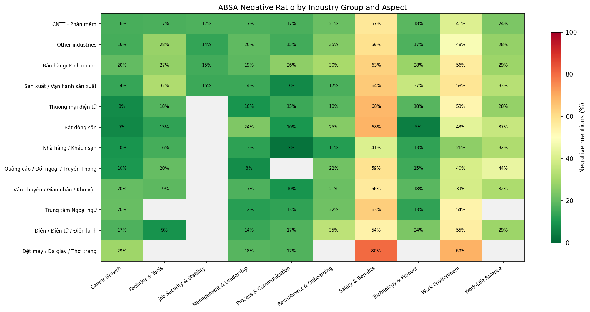
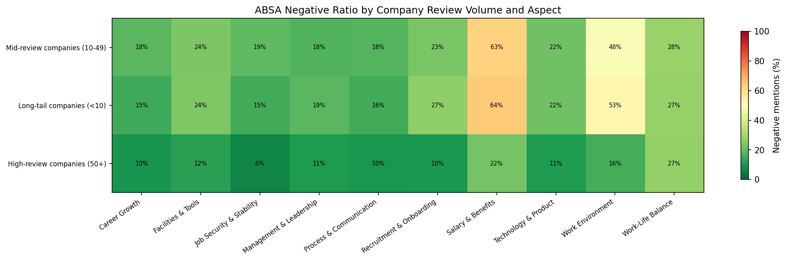
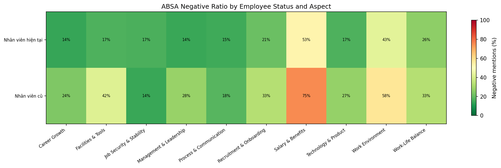
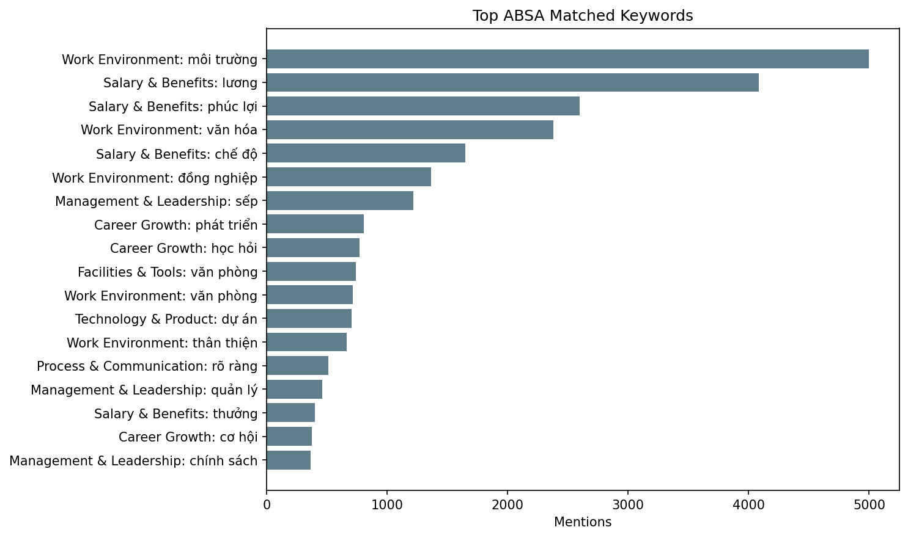
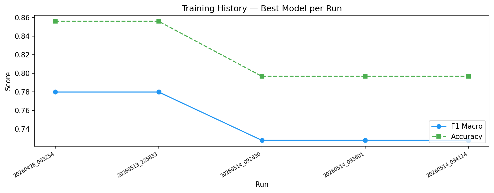

# Sentiment Analysis — Training Report

**Generated:** 2026-05-14 09:44:35  
**Run ID:** `run_20260514_094114`  
**Timestamp:** 2026-05-14T09:44:33.658872

---
## 1. Overview

| Field | Value |
|-------|-------|
| Dataset | 10,000 reviews |
| Embedding | `fasttext_cc.vi.300_frozen` |
| Feature dim | 305 (300 FastText + 5 handcrafted) |
| Train / Val / Test | 7,000 / 1,500 / 1,500 |
| Balancing | weighted_loss (class_weight='balanced') |
| **Best model** | **MLP_NeuralNet_Tuned** |
| **Best F1 Macro** | **0.7277** |
| **Best Accuracy** | **0.7967** |

---
## 2. Class Distribution

| Class | Count | % |
|-------|------:|--:|
| Negative | 2,370 | 23.7% |
| Neutral | 1,904 | 19.0% |
| Positive | 5,726 | 57.3% |

**Class weights (balanced):** `negative=1.406`, `neutral=1.751`, `positive=0.582`

---
## 3. Model Comparison (Test Set)

| Model | Accuracy | F1 Macro | F1 Weighted | Precision | Recall |
|-------|--------:|--------:|----------:|--------:|------:|
| **MLP_NeuralNet_Tuned** ★ | 0.7967 | 0.7277 | 0.7951 | 0.7317 | 0.7241 |
| **MLP_NeuralNet_Tuned_NeutralBoost** | 0.7880 | 0.7253 | 0.7912 | 0.7291 | 0.7239 |
| **TFIDF_LogisticRegression_NeutralBoost** | 0.7920 | 0.7241 | 0.7921 | 0.7295 | 0.7199 |
| **Ensemble_SoftVote** | 0.7947 | 0.7239 | 0.7898 | 0.7272 | 0.7232 |
| **MLP_NeuralNet_NeutralBoost** | 0.7740 | 0.7228 | 0.7819 | 0.7171 | 0.7335 |
| **Ensemble_SoftVote_NeutralBoost** | 0.7720 | 0.7149 | 0.7780 | 0.7135 | 0.7191 |
| **TFIDF_LogisticRegression** | 0.7987 | 0.7141 | 0.7886 | 0.7270 | 0.7077 |
| **MLP_NeuralNet** | 0.7847 | 0.7114 | 0.7804 | 0.7100 | 0.7179 |
| **TFIDF_LinearSVC_NeutralBoost** | 0.7920 | 0.7053 | 0.7808 | 0.7268 | 0.6924 |
| **LogisticRegression_NeutralBoost** | 0.7713 | 0.7051 | 0.7725 | 0.6993 | 0.7127 |
| **LSTM_NeuralNet** | 0.7533 | 0.6997 | 0.7606 | 0.6909 | 0.7143 |
| **LinearSVC** | 0.7647 | 0.6963 | 0.7665 | 0.6903 | 0.7045 |
| **LogisticRegression** | 0.7520 | 0.6915 | 0.7601 | 0.6880 | 0.6988 |
| **TFIDF_LinearSVC** | 0.7920 | 0.6833 | 0.7663 | 0.7294 | 0.6771 |
| **RandomForest_NeutralBoost** | 0.7560 | 0.6652 | 0.7393 | 0.7257 | 0.6386 |
| **GaussianNB** | 0.7047 | 0.6504 | 0.7167 | 0.6466 | 0.6620 |
| **RandomForest** | 0.7620 | 0.6478 | 0.7282 | 0.7777 | 0.6235 |

---
## 4. Per-Class F1 Score

| Model | Negative F1 | Neutral F1 | Positive F1 |
|-------|----------:|--------:|----------:|
| MLP_NeuralNet_Tuned | 0.7765 | 0.5089 | 0.8977 |
| MLP_NeuralNet_Tuned_NeutralBoost | 0.7658 | 0.5173 | 0.8926 |
| TFIDF_LogisticRegression_NeutralBoost | 0.7731 | 0.5034 | 0.8958 |
| Ensemble_SoftVote | 0.7913 | 0.4924 | 0.8879 |
| MLP_NeuralNet_NeutralBoost | 0.7784 | 0.5197 | 0.8704 |
| Ensemble_SoftVote_NeutralBoost | 0.7732 | 0.4992 | 0.8725 |
| TFIDF_LogisticRegression | 0.7837 | 0.4582 | 0.9003 |
| MLP_NeuralNet | 0.7839 | 0.4677 | 0.8828 |
| TFIDF_LinearSVC_NeutralBoost | 0.7745 | 0.4475 | 0.8940 |
| LogisticRegression_NeutralBoost | 0.7703 | 0.4718 | 0.8731 |
| LSTM_NeuralNet | 0.7784 | 0.4717 | 0.8490 |
| LinearSVC | 0.7540 | 0.4623 | 0.8727 |
| LogisticRegression | 0.7465 | 0.4642 | 0.8639 |
| TFIDF_LinearSVC | 0.7916 | 0.3714 | 0.8869 |
| RandomForest_NeutralBoost | 0.6927 | 0.4476 | 0.8554 |
| GaussianNB | 0.7174 | 0.4183 | 0.8154 |
| RandomForest | 0.7184 | 0.3757 | 0.8492 |

> **Note:** Neutral class remains the hardest; support in the test set is 285 samples.

---
## 5. Best Model: MLP_NeuralNet_Tuned

### Classification Report (Test Set)

| Class | Precision | Recall | F1 | Support |
|-------|--------:|------:|---:|-------:|
| Negative | 0.7924 | 0.7612 | 0.7765 | 356 |
| Neutral | 0.5162 | 0.5018 | 0.5089 | 285 |
| Positive | 0.8865 | 0.9092 | 0.8977 | 859 |
| **Macro Avg** | 0.7317 | 0.7241 | 0.7277 | 1500 |

---
## 6. ABSA Summary (Aspect-Based Sentiment)

| Aspect | Positive | Negative | Neutral | Neg% |
|--------|--------:|--------:|-------:|-----:|
| Career Growth | 2,737 | 528 | 78 | 16% |
| Facilities & Tools | 959 | 266 | 37 | 22% |
| Job Security & Stability | 485 | 94 | 6 | 16% |
| Management & Leadership | 1,973 | 401 | 16 | 17% |
| Process & Communication | 1,047 | 195 | 7 | 16% |
| Recruitment & Onboarding | 918 | 279 | 10 | 23% |
| Salary & Benefits | 3,707 | 5,626 | 55 | 60% |
| Technology & Product | 1,048 | 252 | 39 | 19% |
| Work Environment | 5,773 | 5,087 | 73 | 47% |
| Work-Life Balance | 781 | 301 | 11 | 28% |

**Total aspect mentions:** 32,789

### Key Insights
- Most praised: **Work Environment** (5,773 positive mentions)
- Most complained: **Salary & Benefits** (5,626 negative mentions)
- Highest negative ratio: **Salary & Benefits** (60%)

### Detailed Drilldowns

- Latest month hotspot: **Facilities & Tools** in `2026-04` (33.3% negative, 33 mentions)

**Largest negative-ratio increases over time**
| Aspect | Start Neg% | Latest Neg% | Delta | Latest Mentions |
|--------|-----------:|------------:|------:|----------------:|
| Facilities & Tools | 19.4% | 36.7% | 17.4 pp | 79 |
| Work Environment | 17.9% | 34.0% | 16.0 pp | 833 |
| Work-Life Balance | 18.2% | 29.3% | 11.2 pp | 92 |

**Industry/aspect hotspots (min 20 mentions)**
| Industry | Aspect | Mentions | Neg% |
|----------|--------|---------:|-----:|
| Trường Quốc tế | Salary & Benefits | 47 | 91.5% |
| Hàng không | Salary & Benefits | 42 | 85.7% |
| Dược phẩm | Salary & Benefits | 100 | 83.0% |
| Nhân sự | Salary & Benefits | 121 | 82.6% |
| Trường Quốc tế | Work Environment | 55 | 81.8% |
| Tổ chức sự kiện | Salary & Benefits | 26 | 80.8% |
| Dệt may / Da giày / Thời trang | Salary & Benefits | 257 | 80.2% |
| Trường dạy nghề | Salary & Benefits | 25 | 80.0% |

**Company-volume group hotspots**
| Company Group | Aspect | Mentions | Neg% |
|---------------|--------|---------:|-----:|
| Long-tail companies (<10) | Salary & Benefits | 3,571 | 64.3% |
| Mid-review companies (10-49) | Salary & Benefits | 5,045 | 62.6% |
| Long-tail companies (<10) | Work Environment | 4,027 | 52.8% |
| Mid-review companies (10-49) | Work Environment | 5,701 | 48.5% |
| Mid-review companies (10-49) | Work-Life Balance | 535 | 27.9% |
| Long-tail companies (<10) | Work-Life Balance | 336 | 27.4% |
| High-review companies (50+) | Work-Life Balance | 222 | 27.0% |
| Long-tail companies (<10) | Recruitment & Onboarding | 382 | 26.7% |

---
## 7. Training History

| Run | Samples | Best Model | F1 Macro | Accuracy |
|-----|-------:|-----------|--------:|--------:|
| `run_20260428_003254` | 10,000 | MLP_NeuralNet | 0.7798 | 0.856 |
| `run_20260513_225833` | 10,000 | MLP_NeuralNet | 0.7798 | 0.856 |
| `run_20260514_092630` | 10,000 | MLP_NeuralNet_Tuned | 0.7277 | 0.7967 |
| `run_20260514_093601` | 10,000 | MLP_NeuralNet_Tuned | 0.7277 | 0.7967 |
| `run_20260514_094114` | 10,000 | MLP_NeuralNet_Tuned | 0.7277 | 0.7967 |

---
*Report generated by `analysis/generate_report.py`*