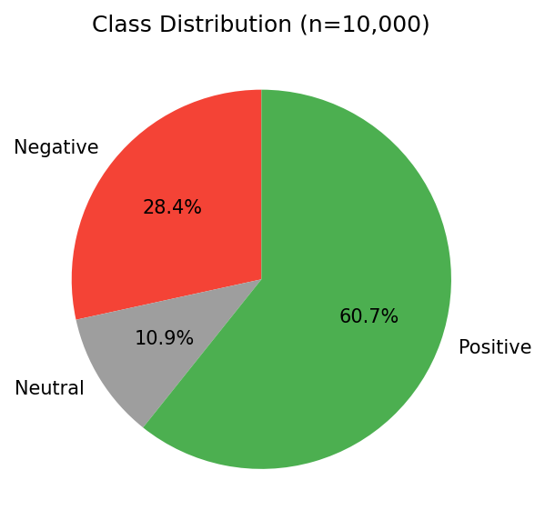
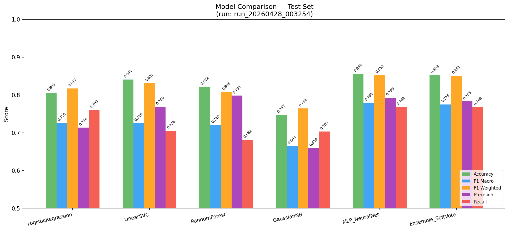
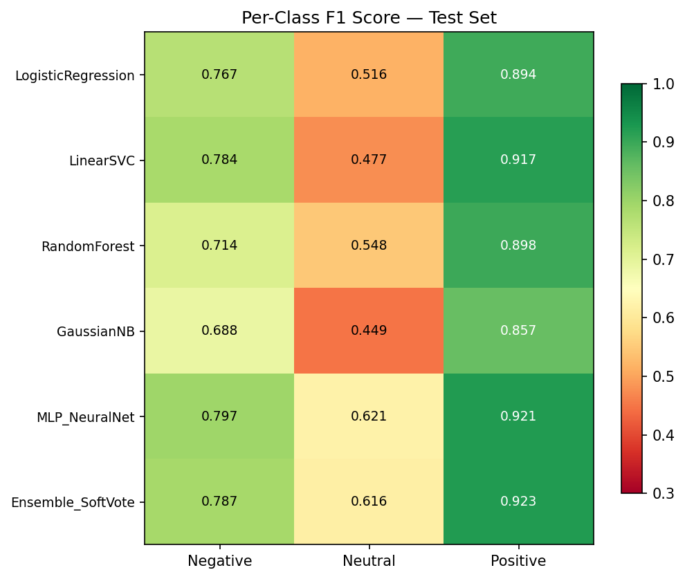
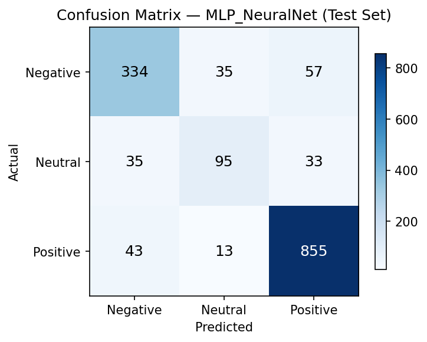
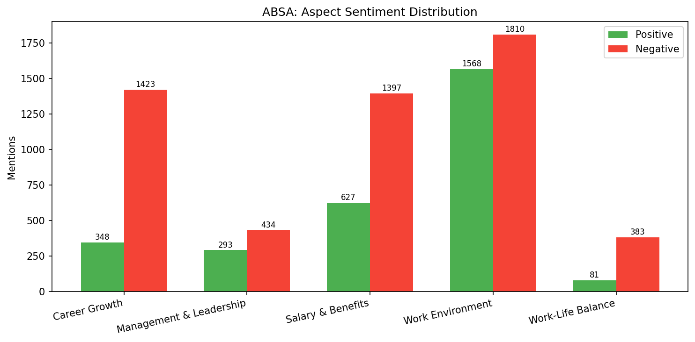

# Sentiment Analysis — Training Report

**Generated:** 2026-04-28 00:43:08  
**Run ID:** `run_20260428_003254`  
**Timestamp:** 2026-04-28T00:39:43.002126

---
## 1. Overview

| Field | Value |
|-------|-------|
| Dataset | 10,000 reviews |
| Embedding | `fasttext_cc.vi.300_frozen` |
| Feature dim | 305 (300 FastText + 5 handcrafted) |
| Train / Val / Test | 7,000 / 1,500 / 1,500 |
| Balancing | weighted_loss (class_weight='balanced') |
| **Best model** | **MLP_NeuralNet** |
| **Best F1 Macro** | **0.7798** |
| **Best Accuracy** | **0.856** |

---
## 2. Class Distribution

| Class | Count | % |
|-------|------:|--:|
| Negative | 2,842 | 28.4% |
| Neutral | 1,086 | 10.9% |
| Positive | 6,072 | 60.7% |

**Class weights (balanced):** `negative=1.173`, `neutral=3.069`, `positive=0.549`

---
## 3. Model Comparison (Test Set)

| Model | Accuracy | F1 Macro | F1 Weighted | Precision | Recall |
|-------|--------:|--------:|----------:|--------:|------:|
| **MLP_NeuralNet** ★ | 0.8560 | 0.7798 | 0.8534 | 0.7933 | 0.7685 |
| **Ensemble_SoftVote** | 0.8527 | 0.7752 | 0.8508 | 0.7833 | 0.7679 |
| **LogisticRegression** | 0.8053 | 0.7260 | 0.8172 | 0.7137 | 0.7600 |
| **LinearSVC** | 0.8407 | 0.7259 | 0.8312 | 0.7689 | 0.7055 |
| **RandomForest** | 0.8220 | 0.7201 | 0.8078 | 0.7986 | 0.6816 |
| **GaussianNB** | 0.7473 | 0.6645 | 0.7645 | 0.6593 | 0.7031 |

---
## 4. Per-Class F1 Score

| Model | Negative F1 | Neutral F1 | Positive F1 |
|-------|----------:|--------:|----------:|
| MLP_NeuralNet | 0.7971 | 0.6209 | 0.9213 |
| Ensemble_SoftVote | 0.7871 | 0.6159 | 0.9227 |
| LogisticRegression | 0.7674 | 0.5164 | 0.8943 |
| LinearSVC | 0.7841 | 0.4769 | 0.9166 |
| RandomForest | 0.7139 | 0.5483 | 0.8981 |
| GaussianNB | 0.6880 | 0.4487 | 0.8568 |

> **Note:** Neutral class is hardest — smallest support (163 samples) and highest class imbalance.

---
## 5. Best Model: MLP_NeuralNet

### Classification Report (Test Set)

| Class | Precision | Recall | F1 | Support |
|-------|--------:|------:|---:|-------:|
| Negative | 0.8107 | 0.7840 | 0.7971 | 426 |
| Neutral | 0.6643 | 0.5828 | 0.6209 | 163 |
| Positive | 0.9048 | 0.9385 | 0.9213 | 911 |
| **Macro Avg** | 0.7933 | 0.7685 | 0.7798 | 1500 |

---
## 6. ABSA Summary (Aspect-Based Sentiment)

| Aspect | Positive | Negative | Neutral | Neg% |
|--------|--------:|--------:|-------:|-----:|
| Career Growth | 348 | 1,423 | 190 | 80% |
| Management & Leadership | 293 | 434 | 42 | 60% |
| Salary & Benefits | 627 | 1,397 | 59 | 69% |
| Work Environment | 1,568 | 1,810 | 166 | 54% |
| Work-Life Balance | 81 | 383 | 24 | 83% |

**Total aspect mentions:** 8,845

### Key Insights
- Most praised: **Work Environment** (1,568 positive mentions)
- Most complained: **Work Environment** (1,810 negative mentions)
- Highest negative ratio: **Work-Life Balance** (83%)

---
*Report generated by `analysis/generate_report.py`*